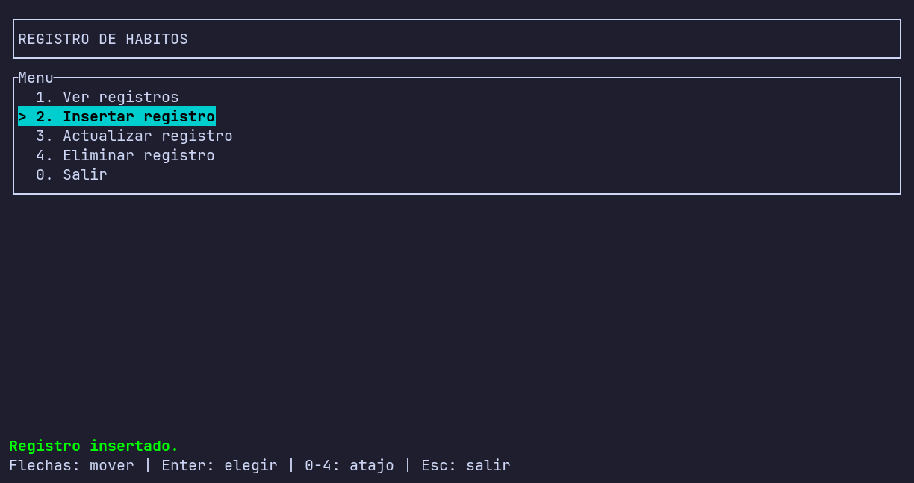
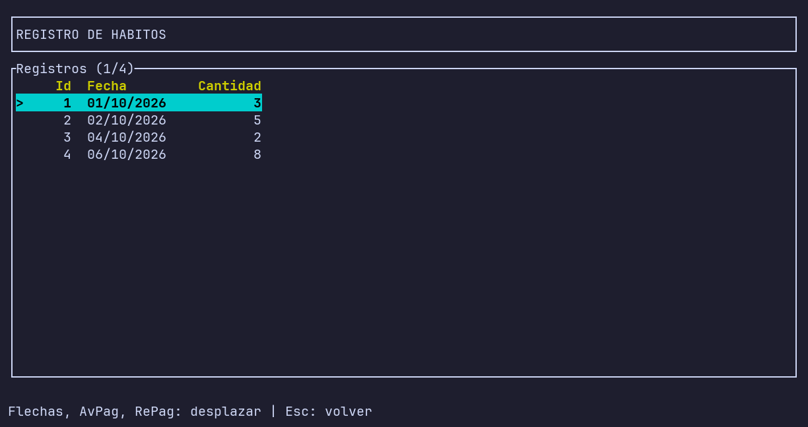
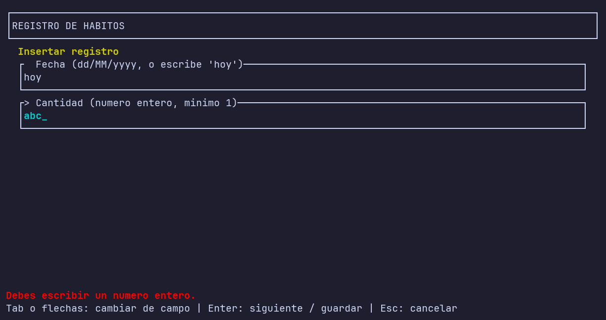
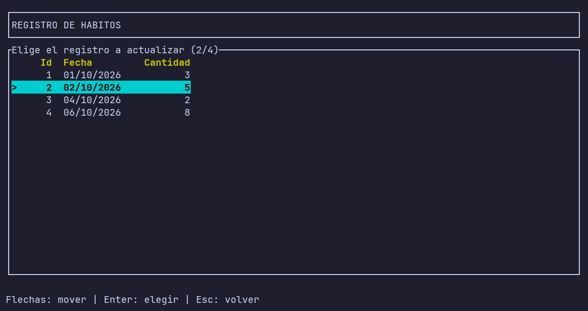
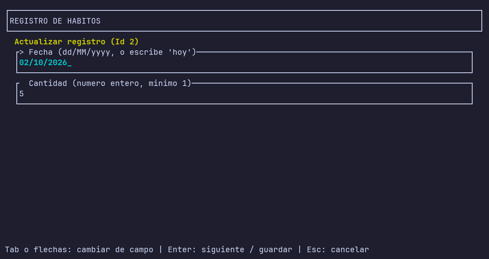
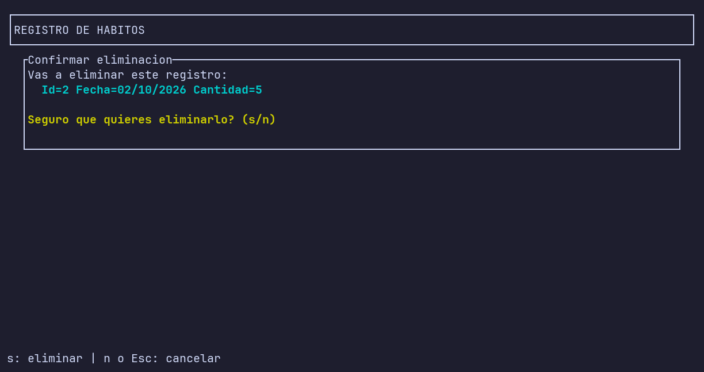

# 🖥️ HabitLogger TUI (versión terminal)

**Registro de hábitos con interfaz de terminal (TUI) escrito en C#.**

Es la misma aplicación que [HabitLogger](../HabitLogger/README.md), pero en lugar de preguntar por consola se maneja con el teclado sobre pantallas dibujadas con [Ratatui.cs](https://www.nuget.org/packages/Ratatui.cs): menú, listas, formularios y confirmaciones.

## ✨ Funciones

- Menú navegable con flechas o con atajos numéricos.
- Ver, insertar, actualizar y eliminar registros (fecha y cantidad).
- Lista con selección y desplazamiento (flechas, `AvPag`, `RePag`, `Inicio`, `Fin`).
- Formulario con validación: fecha `dd/MM/yyyy` (o `hoy`) y cantidad entera mínima 1.
- Confirmación antes de eliminar.
- Mensajes de éxito o error en la línea inferior.
- Log diario de operaciones y tabla `Errores` en la BD.

## 🚀 Ejecución

Necesitas el **SDK de .NET 10** y una terminal interactiva de al menos **80×14**.

```bash
dotnet run --project HabitLoggerTui
```

> ⚠️ No funciona con la entrada o la salida redirigidas.

## ⌨️ Teclas

| Pantalla | Teclas |
|---|---|
| Menú | `↑` `↓` mover · `Enter` elegir · `0`-`4` atajo · `Esc` salir |
| Listas | `↑` `↓` `AvPag` `RePag` `Inicio` `Fin` desplazar · `Enter` elegir · `Esc` volver |
| Formulario | `Tab` o flechas cambiar de campo · `Enter` siguiente / guardar · `Esc` cancelar |
| Confirmación | `s` eliminar · `n` o `Esc` cancelar |
| Cualquier pantalla | `Ctrl+C` salir |

## 📸 Capturas

### Menú principal


### Ver registros


### Formulario con validación


### Elegir un registro


### Actualizar un registro


### Confirmar eliminación


## 🗂️ Estructura

| Archivo | Responsabilidad |
|---|---|
| `Program.cs` | Punto de entrada: prepara la BD y lanza la TUI |
| `Aplicacion.cs` | Pantallas, teclado y dibujado |
| `Validacion.cs` | Comprueba fechas y cantidades |
| `GestorHabitos.cs` | Operaciones sobre la tabla `Habitos` |
| `Habito.cs` | Modelo de un registro (`Id`, `Fecha`, `Cantidad`) |
| `DataBaseConnector/` | Conexión única y compartida con SQLite |
| `LogErrores.cs` / `LogOperaciones.cs` | Errores en BD y log diario |

## 💾 Datos

La base de datos (`mi_bbdd.bd`) y la carpeta `logs/` se crean junto al ejecutable (`bin/`). A diferencia de la versión de consola, aquí todos los registros van en una única tabla `Habitos`.

## 🧰 Tecnologías

- C# / .NET 10
- SQLite con `Microsoft.Data.Sqlite`
- Ratatui.cs 0.3.3
