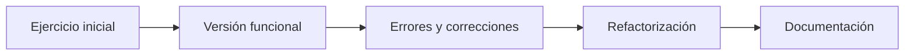

<div align="center">

# 📚 DAM · Segundo Curso

### Ejercicios, prácticas y proyectos del ciclo de **Desarrollo de Aplicaciones Multiplataforma**


</div>

---

## 📑 Índice

- [🎯 Sobre el repositorio](#-sobre-el-repositorio)
- [🧭 Módulos de un vistazo](#-módulos-de-un-vistazo)
- [🗂️ Estructura](#️-estructura)
- [📘 Detalle de los módulos](#-detalle-de-los-módulos)
- [🖼️ Proyecto destacado: HabitLogger](#️-proyecto-destacado-habitlogger)
- [🚀 Cómo ejecutar los proyectos](#-cómo-ejecutar-los-proyectos)
- [🛠️ Tecnologías](#️-tecnologías)
- [📈 Evolución](#-evolución)
- [🧑‍💻 Autor](#-autor)

---

## 🎯 Sobre el repositorio

Este repositorio recopila los **ejercicios, prácticas y proyectos** que realizo durante el segundo año del Grado Superior de **Desarrollo de Aplicaciones Multiplataforma (DAM)**.

Sirve a tres propósitos:

| | Propósito |
|---|---|
| 🗃️ | **Archivo organizado** por módulos de los trabajos más relevantes del curso. |
| 📈 | **Registro de mi evolución técnica**, con sus errores, correcciones y refactorizaciones. |
| 💼 | **Base de referencia y portfolio** para futuros proyectos. |

> [!NOTE]
> No todos los ejercicios del curso están aquí: se conservan los **representativos o útiles como referencia**. Algunos son prácticas académicas de experimentación y no código listo para producción.

---

## 🧭 Módulos de un vistazo

| Módulo | Carpeta | Tecnología | Contenido |
|:--|:--|:--:|:--|
| ⚙️ **PSP** · Programación de Servicios y Procesos | [`PSP/`](PSP) |  | Prueba inicial con 4 ejercicios y modelo de dominio |
| 🐍 **Python** · Programación e IA | [`Python/`](Python) |  | 2 unidades · **61 actividades** resueltas |
| 🖥️ **Desarrollo de Interfaces** | [`Desarrollo_Interfaces/`](Desarrollo_Interfaces) |  | Ejercicios de clase y 2 casos prácticos |
| 🗄️ **Acceso a Datos** | [`Acceso_Datos/`](Acceso_Datos) |  | Ficheros binarios, excepciones propias y pruebas |
| 📱 **Desarrollo de Aplicaciones Móviles** | [`Desarrollo_Aplicaciones_Moviles/`](Desarrollo_Aplicaciones_Moviles) |  | Iniciación a Kotlin |

---

## 🗂️ Estructura

```text
📦 DAM_26-27
┣ 📂 PSP
┃ ┗ 📂 01-PruebaInicial ............... Maven · Java
┣ 📂 Python
┃ ┣ 📂 01-Introduccion-a-Python ....... 19 actividades
┃ ┗ 📂 02-Control-flujo-estructura-datos  42 actividades
┣ 📂 Desarrollo_Interfaces
┃ ┣ 📂 EjerciciosPresentacion ......... introducción a C#
┃ ┣ 📂 EjerciciosClase ................ POO y ejercicios en clase
┃ ┣ 📂 01_CasoPractico_MathGame ....... juego de matemáticas
┃ ┗ 📂 02_CasoPractico_HabitLogger .... consola + TUI + SQLite
┣ 📂 Acceso_Datos
┃ ┣ 📂 EjercicioEditorBinario ......... editor de ficheros binarios
┃ ┗ 📂 TestUnit1CreateAFile ........... creación de ficheros y pruebas
┣ 📂 Desarrollo_Aplicaciones_Moviles
┃ ┗ 📂 IniciacionAKotlin .............. Maven · Kotlin
┗ 📄 README.md
```

---

## 📘 Detalle de los módulos

<details open>
<summary><b>⚙️ PSP — Programación de Servicios y Procesos</b></summary>

<br>

**`PSP/01-PruebaInicial`** · proyecto Maven (Java 26).

- 4 ejercicios (`Ejercicio1` … `Ejercicio4`) en el paquete `ejercicios`.
- Modelo de dominio con clases como `Alumno` y `Asignatura`.
- Refactorizaciones documentadas en el historial de commits.

</details>

<details open>
<summary><b>🐍 Python — Programación e Inteligencia Artificial</b></summary>

<br>

| Unidad | Tema | Actividades |
|:--|:--|:--:|
| [UD1](Python/01-Introduccion-a-Python/ejercicios) | Introducción a Python: entorno, tipos, operadores y depuración | 19 |
| [UD2](Python/02-Control-flujo-estructura-datos/ejercicios) | Control de flujo y estructuras de datos: condicionales, bucles y listas | 42 |

Cada actividad es un script independiente con su enunciado comentado, por ejemplo clasificador de edades, FizzBuzz, comprobación de primos, palíndromos o calculadoras.

</details>

<details open>
<summary><b>🖥️ Desarrollo de Interfaces — C# y .NET 10</b></summary>

<br>

| Carpeta | Descripción |
|:--|:--|
| [`EjerciciosPresentacion`](Desarrollo_Interfaces/EjerciciosPresentacion) | Primer programa, entorno de desarrollo, estructura sintáctica, variables y tipos de datos. |
| [`EjerciciosClase`](Desarrollo_Interfaces/EjerciciosClase) | Cálculo de área, día de la semana y programación orientada a objetos (vehículos). |
| [`01_CasoPractico_MathGame`](Desarrollo_Interfaces/01_CasoPractico_MathGame) | 🧮 Juego de matemáticas por consola con historial y estadísticas. |
| [`02_CasoPractico_HabitLogger`](Desarrollo_Interfaces/02_CasoPractico_HabitLogger) | 📝 Registro de hábitos con SQLite, en versión **consola** y versión **TUI**. |

</details>

<details open>
<summary><b>🗄️ Acceso a Datos — Java</b></summary>

<br>

- [`EjercicioEditorBinario`](Acceso_Datos/EjercicioEditorBinario): edición de ficheros binarios con excepciones propias (`MyFileNotFoundException`, `MyPointerIsNullException`, `MyPointerOutOfBoundException`).
- [`TestUnit1CreateAFile`](Acceso_Datos/TestUnit1CreateAFile): creación de ficheros y primeros ejercicios de la unidad.

</details>

<details open>
<summary><b>📱 Desarrollo de Aplicaciones Móviles — Kotlin</b></summary>

<br>

- [`IniciacionAKotlin`](Desarrollo_Aplicaciones_Moviles/IniciacionAKotlin): primer contacto con el lenguaje mediante un proyecto Maven.

</details>

---

## 🖼️ Proyecto destacado: HabitLogger

Registro de hábitos (agua, lectura, ejercicio…) donde cada hábito es una tabla **SQLite** con `Id`, `Fecha` y `Cantidad`. Incluye validación de entradas, log diario de operaciones y una tabla `Errores` para que la aplicación nunca se caiga.

| Versión | Descripción | Documentación |
|:--|:--|:--|
| 💻 Consola | Menú numerado | [README](Desarrollo_Interfaces/02_CasoPractico_HabitLogger/HabitLogger/README.md) |
| 🖥️ TUI | Interfaz de terminal con formularios | [README](Desarrollo_Interfaces/02_CasoPractico_HabitLogger/HabitLoggerTui/README.md) |

<table>
  <tr>
    <td align="center"><br><sub>Menú principal</sub></td>
    <td align="center"><br><sub>Lista de registros</sub></td>
  </tr>
  <tr>
    <td align="center"><br><sub>Validación de formularios</sub></td>
    <td align="center"><br><sub>Actualizar registro</sub></td>
  </tr>
</table>

---

## 🚀 Cómo ejecutar los proyectos

Cada proyecto es independiente. Clona el repositorio una vez:

```bash
git clone https://github.com/AdriLabTech/DAM_26-27.git
cd DAM_26-27
```

| Tipo | Requisitos | Comando |
|:--|:--|:--|
| 🐍 Python | Python 3 | `python3 Python/02-Control-flujo-estructura-datos/ejercicios/<actividad>.py` |
| 🔷 C# / .NET | SDK de **.NET 10** | `dotnet run --project <carpeta_proyecto>` |
| ☕ Java (Maven) | JDK y Maven | `mvn compile` y ejecutar la clase `Main` desde tu IDE |
| 🟣 Kotlin (Maven) | JDK y Maven | `mvn compile` dentro de `IniciacionAKotlin` |

Ejemplo con HabitLogger:

```bash
dotnet run --project Desarrollo_Interfaces/02_CasoPractico_HabitLogger/HabitLogger
```

> [!TIP]
> Cada caso práctico tiene su propio `README.md` con instrucciones y funciones detalladas.

---

## 🛠️ Tecnologías

| Área | Herramientas |
|:--|:--|
| **Lenguajes** | Java · Kotlin · C# · Python |
| **Construcción** | Maven · .NET CLI |
| **Datos** | SQLite · ficheros binarios |
| **Calidad** | Pruebas unitarias · validación de entradas · gestión de excepciones |
| **Entorno** | Git · Linux · IntelliJ IDEA |

---

## 📈 Evolución

El repositorio no muestra solo el resultado final. También conserva parte del **proceso de aprendizaje**:



- 🧪 Código en desarrollo y distintos enfoques para un mismo problema.
- 🐞 Errores y correcciones.
- ♻️ Refactorizaciones y mejoras a lo largo del curso.
- 📝 Documentación asociada a los trabajos más importantes.

El contenido crecerá conforme se incorporen nuevos módulos.

---

## 🧑‍💻 Autor

<div align="center">

**Adrián Velasco Mañas**

Desarrollo de Aplicaciones Multiplataforma · 2º DAM · Curso 2026 – 2027

[](https://github.com/AdriLabTech)

</div>
